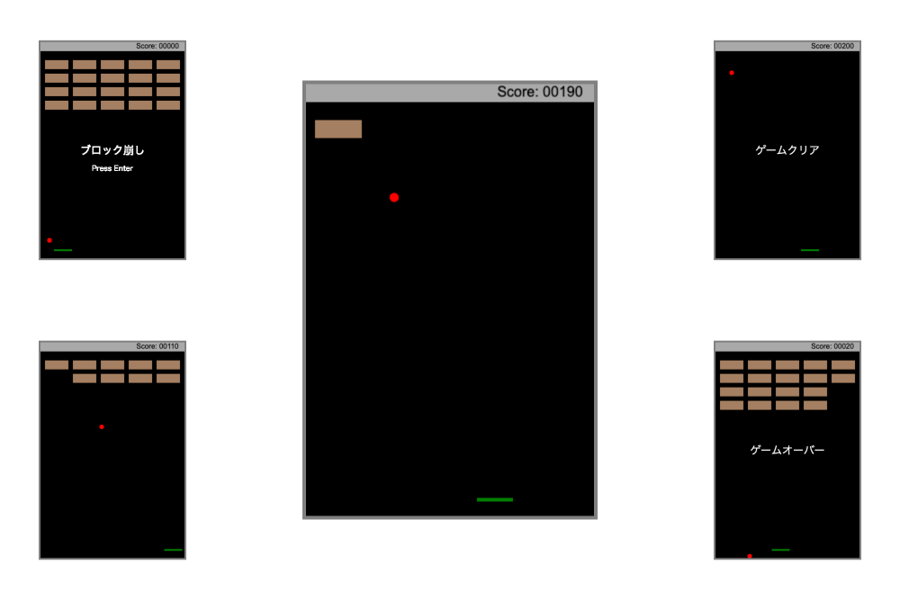

# ブロック崩しゲーム

canvas を使用したブロック崩しゲームです。JavaScript の学習コンテンツで、HTML,CSS,JavaScript で実装しています。

## v1

### 技術スタック

- JavaScript の基本構文（変数、配列、分岐処理、繰り返し処理、関数、クラス）
- DOM とイベント（keydown イベント、keyup イベント）
- canvas

### 画面

### クラス図

ブロック崩し（ビュー関連）

ブロック崩し（ゲーム本体）

## v2

### 技術スタック

- JavaScript の基本構文（変数、配列、分岐処理、繰り返し処理、関数、クラス）
- DOM とイベント（keydown イベント、keyup イベント）
- canvas と audio

### 画面

